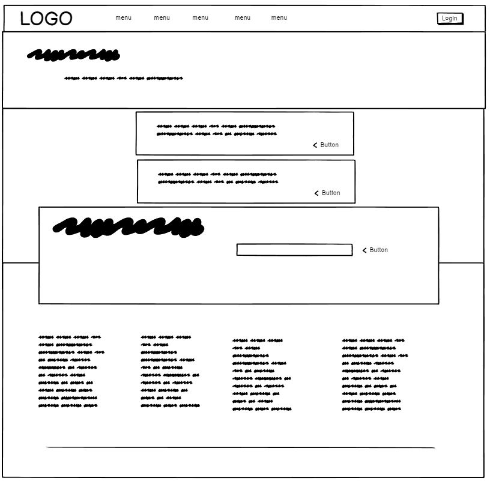
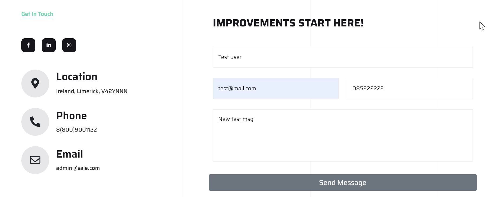
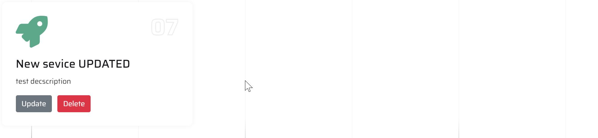

# SeoAgency

## Table of Contents
1. [Introduction](#introduction)
2. [User Stories](#user-stories)
3. [MVP Scope](#mvp-scope)
4. [Features](#features)
    - [Existing Features](#existing-features)
    - [Future Features](#future-features)
5. [Technologies Used](#technologies-used)
6. [Validation and Testing](#validation-and-testing)
    - [HTML Validation](#html-validation)
    - [CSS Validation](#css-validation)
    - [JavaScript and Python Code Validation](#javascript-and-python-code-validation)
    - [Manual Testing](#manual-testing)
7. [Deployment](#deployment)
8. [SEO and Advertising Strategy](#seo-and-advertising-strategy)
9. [Credits](#credits)
10. [Acknowledgments](#acknowledgments)


Visit the [live site](https://agency-8f506ba47bf6.herokuapp.com/)

SeoAgency is a prototype of a commercial website that was developed as part of the Full-Stack Software Development Course at the Code Institute. The primary objective of this project was to create a foundational website that, with specific enhancements, could be fully utilized in a professional setting.

The core purpose of the commercial website is to attract clients. It features key sections such as Services and a Price List. The Services page is designed to generate leads; clicking on any service directs users to a contact form. This form not only records inquiries in a database but also optionally interacts with a CRM system, facilitating seamless customer relationship management.

The Price List page focuses on a main offering: SEO support for online projects. It allows users to view different service packages, choose one, and subscribe via a sandboxed PayPal integration, demonstrating the site's e-commerce capability. Additionally, the site includes a subscription form powered by [Mailtrap](https://mailtrap.io)  in email testing mode, ensuring reliable email delivery testing during the development phase.

Future plans for the project include deploying it on a real domain, expanding the Services page to enhance client trust through a portfolio page, and integrating a chatbot for immediate communication with potential customers. This approach aims to solidify SeoAgency as a robust tool for businesses seeking effective online presence management.

## User Stories Documentation

### Introduction

This document outlines the user stories developed for the project, structured to guide the development process and feature prioritization. The user stories define the functionalities that will provide the most value to both the users and the business during the initial phases of the project.

### Prioritization Framework

I have employed the MoSCoW method for prioritizing the user stories to ensure that we focus on delivering the most critical features first. This method categorizes features into:

- **Must have**: Essential features that are required for launch.
- **Should have**: Important but not necessary for launch.
- **Could have**: Desirable but not necessary and could improve user experience or customer satisfaction.
- **Won't have this time**: Agreed upon not to be developed in this release cycle.

### MVP Scope

The following key functionalities are defined as part of the MVP to streamline the development process and ensure a timely launch:

- **Must have** tasks, including:
  - Setup and Deploy
  - Home Page Interaction
  - Subscription Management

- **Should have** tasks, including:
  - Contact Us Page Interaction
  - Services Interaction
  - Admin Update Service

- **Could have** tasks, not implemented in the MVP due to prioritization:
  - Change Password
  - Update Profile
  - Collect Feedback

These tasks have been deferred to post-launch phases or future updates based on their current priority status and resource allocation. They are recognized as valuable but not essential for the initial launch.

### Assignees

I am assigned to crucial tasks that align with the MVP's strategic goals, focusing on ensuring robust core functionalities are implemented and tested before the initial rollout.

### Conclusion

The use of the MoSCoW method has allowed us to clearly define and communicate the project's scope and necessary resources. By focusing on the 'Must have' and 'Should have' categories, we aim to launch with a solid foundation while leaving room for scalability and future enhancements.

## User Stories

### Epic 1: User Account Management

#### 1. Create an Account (MUST)

- **Name:** CreateAccount
- **Title:** Enable users to create a new account
- **Description:** "As a user, I want to be able to create an account so that I can have a personalized experience on the website."
- **Acceptance Criteria:**
  1. The user can access a registration form from the homepage.
  2. The registration form requires a username, email, and password.

#### 2. Log In (MUST)

- **Name:** LogIn
- **Title:** Enable user login for account access
- **Description:** "As a user, I want to be able to log in to my account so that I can access my personal settings."
- **Acceptance Criteria:**
  1. The user can access a login form from the header.
  2. The login form requires a name and password.
  3. The user is redirected to their home upon successful login.

#### 3. Log Out

- **Name:** LogOut
- **Title:** Allow users to securely log out
- **Description:** "As a user, I want to be able to log out of my account so that I can ensure my account is secure when not in use."
- **Acceptance Criteria:**
  1. The logout option is easily accessible from the user's menu page.
  2. The user is redirected to the homepage after logging out.

#### 4. Update Profile (COULD)

- **Name:** UpdateProfile
- **Title:** Allow users to update their profile information
- **Description:** "As a user, I can update my profile information so that I can keep my personal information up to date."
- **Acceptance Criteria:**
  1. The user can access their profile settings from their dashboard.
  2. The user can update information such as their name, email, and password.
  3. Changes are saved immediately after the user confirms the update.

#### 5. Change Password (COULD)

- **Name:** ChangePassword
- **Title:** Allow users to change their password
- **Description:** "As a user, I can change my password so that I can ensure my account's security is up to date."
- **Acceptance Criteria:**
  1. The user can access a change password option from their profile settings.
  2. The user must enter their current password and a new password twice for confirmation.

### Epic 2: Website Interaction

#### 1. Home Page Interaction (MUST)

- **Name:** HomePageInteraction
- **Title:** Enhance user interaction with an engaging and informative home page
- **Description:** "As a user, I want to easily find information about SeoAgency and enjoy interacting with a dynamic home page so that I can have a positive experience and be motivated to explore further."
- **Acceptance Criteria:**
  1. The home page prominently features information about SeoAgency, including services and achievements.
  2. Interactive elements such as sliders, hover effects, and dynamic content are implemented to engage users.
  3. Navigation is intuitive, allowing users to easily find additional content and resources.
  4. The design and layout of the home page are visually appealing and aligned with the brand's image.

#### 2. Contact Us Page Interaction (SHOULD)

- **Name:** ContactUsPageInteraction
- **Title:** Facilitate user interaction with a comprehensive Contact Us page
- **Description:** "As a user, I want to easily contact SeoAgency through a Contact Us page that includes a form with fields for my name, email, phone, and message, ensuring that my inquiries are recorded in the database for efficient response management."
- **Acceptance Criteria:**
  - The Contact Us page features a form that captures the user's name, email, phone number, and a message.
  - Each entry in the form is validated to ensure the data is in the correct format before submission.
  - Upon submission, the user's data is securely saved to a database, ensuring that the information can be accessed by customer service for follow-up.

#### 3. Services Interaction (SHOULD)

- **Name:** EnhancedServicesInteraction
- **Title:** Enhance interaction with services to improve user engagement and simplify administration
- **Description:** "As a user, I want to easily understand and interact with the services offered, including the ability to contact directly and submit requests. As an administrator, I want to effortlessly add, edit, and delete services directly from the website interface without accessing the admin panel. As a site owner, I aim to convert visitors into clients by utilizing an efficient contact form linked with each service."
- **Acceptance Criteria:**
  - **User Experience:**
    1. Users can view detailed descriptions of each service on the main services page.
    2. Each service includes a 'Contact Us' button that leads to a pre-filled contact form or provides direct contact details.
    3. Upon clicking the contact button, users can fill out and submit a form to inquire or request the service.
  - **Administrator Experience:**
    1. Administrators can add, edit, and delete service listings through a simplified interface accessible directly from the website, not just the admin panel.
    2. Changes made by administrators are reflected in real-time on the website.

### Epic 3: Website Administration

#### 1. Admin Create Service (SHOULD)

- **Name:** AdminCreateService
- **Title:** Allow admins to add new services directly from the website interface
- **Description:** "As an admin, I want to add new services to the website directly through a user-friendly interface on the main site so that users can see our latest offerings without my having to access the admin panel."
- **Acceptance Criteria:**
  1. Admins can access the service addition form directly on the website through a secure interface.
  2. New services are visible on the website upon creation.
  3. The process is secured and only accessible by users with admin rights.

#### 2. Admin Update Service (SHOULD)

- **Name:** AdminUpdateService
- **Title:** Allow admins to update existing services directly from the website interface
- **Description:** "As an admin, I want to be able to update service details directly on the website to ensure all service offerings are current and accurate, without needing to access the admin panel."
- **Acceptance Criteria:**
  1. Admins can access an update interface for each service on the website through a secure mechanism.
  2. Changes are immediately reflected on the service pages to ensure accurate and up-to-date information.
  3. This functionality is safeguarded and only available to users with administrative privileges.

#### 3. Admin Delete Service (COULD)

- **Name:** AdminDeleteService
- **Title:** Enable admins to delete services directly from the website interface
- **Description:** "As an admin, I need the ability to remove outdated or unnecessary services from the website directly using an interface accessible outside the admin panel to maintain a clean and relevant service offering."
- **Acceptance Criteria:**
  1. Admins can access a delete option for each service listed directly on the website.
  2. A confirmation process is required to prevent accidental deletions.
  3. Deleted services are immediately removed from the public-facing site.

### Epic 4: Subscription Management

#### 1. Create Subscription (MUST)

- **Name:** CreateSubscription
- **Title:** Enable users to initiate a new subscription
- **Description:** "As a user, I want to subscribe to the website's services so that I can enjoy SEO features."
- **Acceptance Criteria:**
  1. Users can access the subscription form from the price page.
  2. The form captures necessary information and payment details.

#### 2. Delete Subscription (MUST)

- **Name:** DeleteSubscription
- **Title:** Allow users to cancel their subscription
- **Description:** "As a user, I want to cancel my subscription so that I am not billed in the future."
- **Acceptance Criteria:**
  1. Users can easily find the cancel subscription option in their account settings.

#### 3. Subscription Status (SHOULD)

- **Name:** SubscriptionStatus
- **Title:** Provide users with their current subscription status
- **Description:** "As a user, I want to see my current subscription status so that I know the details of my subscription."
- **Acceptance Criteria:**
  1. Users can view their subscription status on their account settings page.

#### 4. Newsletter Subscription (SHOULD)

- **Name:** NewsletterSubscription
- **Title:** Offer a newsletter subscription to users
- **Description:** "As a user, I can subscribe to a newsletter so that I can stay informed about the latest news, offers, and updates from the restaurant."
- **Acceptance Criteria:**
  1. Users can subscribe using their email through a form on the homepage.
  2. Subscribers receive a confirmation email upon successful subscription.

### Epic 5: Site Stability and Performance

#### 1. Testing (SHOULD)

- **Name:** SiteTesting
- **Title:** Ensure site stability through testing
- **Description:** "As a website owner, I want my site to operate stably so that the user experience is uninterrupted and fluid."
- **Acceptance Criteria:**
  1. Manual testing is conducted on all major site features.
  2. Automated testing covers critical pathways and user interactions.

### Epic 6: Website Setup and Deployment

#### 1. Setup and Deploy (MUST)

- **Name:** SetupAndDeploy
- **Title:** Setup and deploy the restaurant website
- **Description:** "As a site owner, I want to create an agency website to enhance user convenience and grow up my business."
- **Acceptance Criteria:**
  1. The website is published on a reliable platform like Heroku.
  2. The database is connected and accessible, ensuring smooth site operation.

### Epic 7: Customer Engagement and Feedback

#### 1. Collect Feedback (COULD)

- **Name:** CollectFeedback
- **Title:** Collect user feedback through a form
- **Description:** "As a website owner, I can collect feedback directly from users so that I can understand their needs and improve the website."
- **Acceptance Criteria:**
  1. A feedback form is available on the website.
  2. Users receive a thank-you message after submitting feedback.

## UX/UI Design

### Using a ThemeForest Bootstrap5 Template for the SEOAGENCY project

For the development SEO agency website, I opted to utilize a pre-designed template from ThemeForest, created by the author thecodegrammer. This decision was strategically made to streamline the development process and focus efforts where they were most needed.

### Reasons for Choosing a Pre-Designed Template

#### 1. **Efficiency in Development**

- **Time Savings:** By using a ready-made template, I significantly reduced the time required for design and layout considerations. This allowed me to launch the project faster than if I had started from scratch.
- **Cost Efficiency:** Pre-designed templates also offer a cost advantage. The reduced development time translates into cost savings, which is crucial for managing the project budget effectively.

#### 2. **Focus on Essential Functionalities**

- **Core Features Prioritization:** With the design elements already in place, I was able to concentrate on integrating and refining the core functionalities that are critical for the project’s success. This focus ensured that I could deliver a robust platform that meets the specific needs of my users.
- **Quality Assurance:** Leveraging a well-constructed template allowed me to maintain high standards of quality for the website’s aesthetics and functionality, ensuring a professional look and feel that aligns with modern web standards.

#### 3. **Customization to Fit Project Needs**

- **Tailored Solutions:** Although the template provided a strong foundation, all pages and elements borrowed from the template were extensively customized to align with my specific project objectives and functions. This customization ensured that every aspect of the template was molded to support the unique features and workflows of my digital agency.
- **Branding Consistency:** Customizing the template also allowed me to seamlessly integrate my brand's visual identity and messaging, providing a consistent user experience that reflects my brand’s values and vision.

The decision to utilize a template from ThemeForest authored by thecodegrammer was instrumental in allowing me to dedicate more resources to critical aspects of the project, such as feature integration, user experience enhancements, and strategic deployment. The template not only provided a high-quality visual framework but also supported extensive customization to ensure that the final product truly represented my digital agency's innovative spirit and operational needs.

#### 4. **Creating wireframes**

During the initial design phase of the project, I utilized **Balsamiq Cloud** to create detailed wireframes for the main pages of the website, including Home, Contact, Price, Services, and MyMenu. This tool enabled me to quickly sketch out the site layout and interface elements, facilitating a clear visualization of the end-user experience early in the development process. Using Balsamiq Cloud helped streamline design decisions and communication of the website's structure, ensuring each page was optimally designed for user interaction and functionality before moving into the development phase.

#### **Home page**


#### **Contact page**


#### **Services page**


#### **Price page**


#### **Mymenu page**



## Features

### Existing Features

### 1. **Interactive Header Menu**

Users landing on the main page can interact with the header menu, which includes:

- **Home**: Navigate back to the homepage at any time.
- **Contact Us**: Access a form to communicate directly with us.
- **Services**: Overview of the services offered.
- **Price**: Detailed pricing information of the services.


### 2. **User Authentication**

- **Existing Users**: Users with an existing account can log in, which transforms the login button to display their username and redirects them to the 'MyMENU' page from the header menu.


- **New Users**: New visitors can register through the 'signUP' link in the header menu, replacing the 'MyMENU'. For unregistered users, the login button remains a generic login prompt.


### 3. **Hero Banner**

- A motivating hero banner with a call-to-action (CTA) button directs users to the Price page, encouraging them to explore service offerings and pricing details.


### 4. **Who We Are Section**

- An informational section titled "Who We Are" details the advantages of choosing SeoAgency, emphasizing the unique selling propositions and core values of the company.


### 5. **Email Subscription**

- Users can subscribe to an email newsletter by entering their email address in the subscription block. This data is stored for email marketing purposes with integration using [Mailtrap.io](https://mailtrap.io/) in developer mode, which can also be scaled for commercial use. During the testing phase, emails are sent to an internal Mailtrap client to simulate real email delivery.

#### Step 1


---

#### Step 2


---

#### Step 3


---

#### Admin Dashboard


---

#### Mailtrap Dashboard


### 6. **Footer Links and Social Media**

- The footer contains contact information, links to major services, and subscription packages. Additionally, social media links, including a dedicated business page for Facebook, are provided to enhance community engagement and user interaction.

---


### 7. **Contact Us Page**

- **Contact Form**: The 'Contact Us' page features a user-friendly contact form that visitors can use to get in touch with SeoAgency. Upon filling out the form, users experience:

  - **Data Validation**: Basic validation checks ensure that the entered data meets the required format, enhancing the reliability of the information received.


  - **Data Storage**: The information provided is securely stored in the database, ensuring user queries are documented and can be responded to effectively.


  - **Success Notification**: After successful submission of the form, users receive an on-screen confirmation message, acknowledging receipt of their query and setting expectations for follow-up communication.


### 8. **Services Page**

#### Visitor Experience

- **Interactive Service Cards**: Visitors to the 'Services' page can explore the various services offered by SeoAgency. Each service is presented in an interactive card format, which, when clicked, redirects the visitor to a contact form. This form enables direct communication with a manager for further discussion and project planning.


#### Administrator Functionality


- **Direct In-Site Editing**: For administrators, the Services page includes functionalities to manage service cards directly from the site interface, without the need to access the admin panel. This includes:

  - **Adding Service Cards**: Administrators can add new service offerings by creating new service cards.


  - **Editing Service Cards**: Existing service cards can be updated to reflect changes in service details or offerings.




- **Deleting Service Cards**: Service cards can be removed when services are no longer offered or need to be updated.


- **Real-Time Updates**: Changes made by administrators are immediately reflected in the database and the user interface is updated in real time, ensuring that the displayed information is always current and accurate. This capability enhances the site's operational efficiency and visual coherence for both users and site managers.

### 9. **Pricing Page**

#### Subscription Options

- **Service Selection**: The Pricing page offers users the choice of one of three subscription-based services. Users can select the service that best fits their needs.
- **PayPal Integration**: Subscription functionality is implemented through integration with PayPal. Currently, the service operates in sandbox mode for testing purposes but can be switched to production mode with minimal changes.


- **Subscription Process**:
  1. **Subscribe Button**: Users start the subscription process by clicking the subscribe button next to the chosen service.

---


  2. **Confirmation and Payment**: Users are then directed to PayPal where they can confirm their choice and proceed with the payment.

---
  

  3. **Payment Details**: Users can either log into their PayPal account or choose to pay with a credit card.

---
  


---
  

  4. **Completion**: Upon successful completion, the subscription is activated.
  


#### Subscription Status Check

- **Active Subscription Redirection**: A functionality checks if the user has an active subscription. If an active subscription is detected, the user is automatically redirected to the 'MyMenu' section, where the current subscription status is displayed as active.

---
  


#### Unauthenticated User Flow

- **Login Redirection**: If a user who is not logged in clicks on the subscription button, they are redirected to the login page. This step ensures that user subscriptions are linked to their account, facilitating management and support.

---


### 10. **My Menu Page**

The 'My Menu' page provides users with several personal account management options, enhancing the user experience by offering direct control over their subscription and account settings.

#### Features of the My Menu Page

- **Subscription Management**:
  - **View Current Subscription Status**: Users can view the details of their current subscription, including the service level.


- **Cancel Subscription**: Users have the option to cancel their ongoing subscription. This action removes the subscription from the user's account and stops any future billing.


- **User Account Management**:
  - **Logout Functionality**: A logout button allows users to securely exit their account, ensuring that their session is safely closed to protect their personal information.


This page is designed to give users  control over their subscriptions, making it easy to manage their interaction with the services provided by the website. The intuitive design ensures that users can easily navigate through their options without needing additional support.

### Future Features Implementation

As we continue to develop and enhance our digital agency platform, there are several features that we plan to implement in the future to further enrich user experience, strengthen security, and ensure compliance with legal standards. Here’s a list of potential future features:

#### 1. **Collect Feedback**

- **Purpose:** To gather valuable input from users about their experiences and satisfaction with the platform.
- **Functionality:**
  - Implement a feedback form accessible through the user dashboard.
  - Provide options for rating services and offering suggestions or criticisms.
  - Use feedback for service improvement and user engagement analytics.

#### 2. **Change Password**

- **Purpose:** To enhance security by enabling users to change their passwords easily.
- **Functionality:**
  - Allow users to change their password through a secure, user-friendly interface in the profile settings.
  - Include strength indicators and recommendations for creating strong passwords.
  - Send confirmation emails upon successful password updates for security verification.

#### 3. **Update User Profile**

- **Purpose:** To allow users to maintain up-to-date and accurate profile information.
- **Functionality:**
  - Provide forms for users to update personal information such as name, contact details, and professional information.
  - Allow users to customize their profile visibility and privacy settings.

#### 4. **Project Page**

- **Purpose:** To showcase detailed information about ongoing and completed projects.
- **Functionality:**
  - Create dynamic project pages that highlight the scope, impact, and status of projects.
  - Include multimedia elements such as images, videos, and downloadable resources.
  - Allow users to comment on and rate projects, facilitating community engagement.

#### 5. **Privacy Policy**

- **Purpose:** To ensure users are informed about how their data is collected, used, and protected.
- **Functionality:**
  - Develop a comprehensive privacy policy that complies with the latest data protection regulations.
  - Make the privacy policy easily accessible from the footer of every page.
  - Regularly update the policy to reflect any changes in practices or regulations.

#### 6. **Terms & Conditions**

- **Purpose:** To define the rules and guidelines that users must agree to in order to use the platform.
- **Functionality:**
  - Create a detailed terms and conditions page that outlines user responsibilities and platform policies.
  - Require users to accept the terms and conditions during registration and when significant updates are made.
  - Provide an easy-to-navigate interface for users to review specific sections of the terms and conditions.

The implementation of these features will be guided by user feedback, business needs, and regulatory requirements. By addressing these areas, we aim to enhance user satisfaction, improve security, and ensure compliance with legal standards, thereby solidifying the foundation for a trusted and effective digital platform.

#### 7. **Password Recovery**

- **Purpose:** To provide users with a reliable method for recovering their password if they forget it.
- **Functionality:**
  - Implement a "Forgot Password" feature accessible from the login page.
  - Send an email with a secure link to the user's registered email address to reset the password.
  - Ensure the password reset process is secured with time-limited links and user verification steps to prevent unauthorized access.
  - Provide users with guidance on creating a new, strong password during the recovery process.

## Database Design and Custom Models Overview

### Planning and Development

In the planning stages of the database for our digital agency platform, a strategic decision was made to design and utilize custom models that cater specifically to our operational and functional needs. Each model was carefully crafted to address specific aspects of the platform, ensuring data integrity and efficient data management.

### Custom Models Description

Here is a brief overview of some of the key models used in the project:

#### Contact Model

- **Purpose:** Manages user inquiries submitted through the contact form.
- **Fields:** Includes name, email, phone, message, and a timestamp for creation.
- **Function:** Stores and organizes user contact information for follow-up and analytics.

#### Sliders Model

- **Purpose:** Controls the slider images on the homepage, each with associated titles, subtitles, and action buttons.
- **Function:** Enhances the user interface by providing dynamic content that highlights key features or services.

### About Model

- **Purpose:** Displays information about the agency, including descriptions, images, and additional text fields.
- **Function:** Offers visitors detailed insights into the agency's background and unique selling points.

### Subscription Model

- **Purpose:** Manages user subscriptions with details about the subscriber, the plan, and the associated costs.
- **Function:** Integrates with PayPal for payment processing and manages subscription statuses.

### Subscriber Model

- **Purpose:** Collects email addresses for the newsletter service.
- **Function:** Serves as a database for marketing outreach, storing subscriber details for future communications.

### Email Template Model

- **Purpose:** Handles the creation and storage of email templates used in marketing campaigns.
- **Function:** Allows for dynamic email content management linked to subscriber lists.

### Price Model

- **Purpose:** Lists the services with detailed pricing information, descriptions, and promotional texts.
- **Function:** Provides potential clients with transparent pricing and service details, enhancing conversion opportunities.

### Service Model

- **Purpose:** Details the various services offered by the agency, including descriptions and icons.
- **Function:** Facilitates easy navigation and understanding of available services for clients.

## EDR Diagram Utilization

To effectively manage and visualize the relationships between these models, an EDR (Entity-Relationship Diagram) was created using pgAdmin 4. This tool was instrumental in:

- **Visualizing Relationships:** The EDR diagram helped clarify how different tables relate to each other and the flow of data across the system.
- **Database Optimization:** It assisted in optimizing the database structure by identifying redundant fields and optimizing foreign key relationships.
- **Simplifying Debugging:** EDR diagrams simplify troubleshooting by providing a clear map of how data moves through the application.

The comprehensive EDR diagram, as crafted in pgAdmin 4, can be seen below, offering a detailed look at how our custom models are interconnected and how data integrity is maintained across the platform.


The use of custom models and an EDR diagram has significantly streamlined the development and maintenance of the database for our digital agency platform, ensuring that we are equipped to handle data effectively and scale operations as needed.

/**

- Performs manual testing on various features of the application, including the interactive header menu, user authentication, hero banner, "Who We Are" section, email subscription, footer links and social media, contact us page, services page, pricing page, account creation, login, and logout functionality, as well as interactions with the home page and services.
-
- The testing results are organized into sections, each with a list of test cases, expected outcomes, actual outcomes, and status indicators. This documentation helps identify successful functionalities and areas needing improvement based on failed test cases.
 */

## Testing 

### Validation HTML Process

The HTML of the following pages has been thoroughly tested for compliance with W3C standards:

- **Home**
- **Contact Us**
- **Services**
- **Price**
- **My Menu**

Each page was submitted to the W3C Validator, which checks the markup validity of Web documents in HTML, XHTML, etc. This ensures that the website's code adheres to the syntax norms and can be expected to behave consistently across different browsers and user agents.

### Results

Here are the outcomes and actions taken for each page tested:

#### Home Page

- **Result:** The Home page passed with no errors or warnings, indicating that the HTML markup is clean and fully compliant with W3C standards.


#### Contact Us Page

- **Result:** Initially, a few minor errors were found related to form input attributes. These were promptly corrected.
- **Action:** Adjustments were made to the `<input>` tags to ensure full compliance.


#### Services Page

- **Result:** No errors were found. The page is compliant with HTML5 standards.
- **Action:** No action needed as the page met all validation requirements.


#### Price Page

- **Result:** No errors were found. The page is compliant with HTML5 standards.
- **Action:** No action needed as the page met all validation requirements.


#### My Menu Page

- **Result:** No errors were found. The page is compliant with HTML5 standards.
- **Action:** No action needed as the page met all validation requirements.


This document provides an extensive overview of manual testing results for each feature, including additional test cases. It highlights successful functionalities and identifies areas needing improvement due to failed tests.

### CSS Validation Report

### Overview

To ensure our website's styling adheres to the highest web standards, we conducted a comprehensive CSS validation using the W3C CSS Validator service available at [W3C CSS Validator](https://jigsaw.w3.org/css-validator/). This step is crucial for identifying and correcting any syntax errors or deprecated practices in our CSS files, which not only enhances browser compatibility but also optimizes the site's performance.

### Validation Process

The CSS files for our website were submitted to the W3C CSS Validator, which checks the CSS against the standards set by the W3C. The goal was to ensure that all styling on the website is up-to-date with the latest CSS specifications.

#### Initial Results

During the initial validation, the following errors were identified:

- **Error in `.price-btn a`**:
  - **Issue:** Incorrect usage of the `transition` property.
  - **Error Message:** `transition(0.5s) is not a 'transition' value.`

 *Screenshot of the validation errors*

These errors indicated misconfigurations in the CSS that could potentially affect the user experience by causing unintended styling behaviors or rendering issues on various devices.

#### Corrections Made

Upon discovering these errors, immediate actions were taken to correct the CSS syntax:

- **Correction**:
  - The `transition` property values were corrected to valid format.
  - Each instance of the erroneous property was reviewed and updated to ensure compliance with CSS standards.

#### Final Validation

After making the necessary corrections, the CSS files were re-validated to ensure no further issues remained. The final validation results confirmed that all previously identified issues had been resolved effectively:

- **Result:** No errors found.
- **Validator Output:** Congratulations! No Error Found.

 *Screenshot of the successful CSS validation*


# Python and JavaScript Code Validation Report

## Overview

As part of our commitment to maintaining high-quality code and best practices, we conducted a thorough validation of our Python and JavaScript files using internal linters integrated within Visual Studio Code (VSCode). These tools are essential for identifying syntax errors, ensuring code consistency, and enforcing coding standards.

## Validation Tools

For **Python**, we utilized the following linter:

- **Pylint**: A highly configurable tool that checks for errors in Python code, enforces a coding standard, and looks for code smells.

For **JavaScript**, we used:

- **ESLint**: A pluggable and configurable linter tool for identifying and reporting on patterns in JavaScript, helping our team avoid silly mistakes and adhere to coding standards.

## Validation Process

The linters were configured to run automatically in the background as part of our development environment in VSCode. Each script file was scanned, and the linters provided real-time feedback on any issues that needed attention. 

## Results

### Python Code Validation

- **Outcome**: No critical errors were detected in the Python scripts. The code conformed to the established Pythonic coding standards, as enforced by Pylint.
- **Action Taken**: Minor recommendations provided by the linter were addressed to improve code readability and performance.

### JavaScript Code Validation

- **Outcome**: ESLint did not detect any critical errors in the JavaScript files. Our codebase adhered closely to the prescribed JavaScript coding standards.
- **Action Taken**: All stylistic recommendations from ESLint were implemented to ensure consistency across the codebase.

The internal linting processes within VSCode have proven to be invaluable tools for our development team. By integrating these linters into our daily coding practices, we have ensured that our code is not only error-free but also aligns with the latest industry standards for Python and JavaScript. This approach has minimized potential runtime errors and improved the maintainability of our code. Going forward, we will continue to rely on these tools to maintain our coding standards and enhance code quality.

### Manual testing

### 1. **Interactive Header Menu Test**

| Test Case                       | Expected Outcome                                 | Actual Outcome                              | Status   | Notes              |
|---------------------------------|---------------------------------------------------|---------------------------------------------|----------|--------------------|
| Click on Home                   | Redirect to the homepage                          | Redirect to the homepage                    | Pass     |                    |
| Click on Contact Us             | Open Contact Us page                              | Open Contact Us page                        | Pass     |                    |
| Click on Services               | Navigate to Services section                      | Navigate to Services section                | Pass     |                    |
| Click on Price                  | Display Pricing information                       | Display Pricing information                 | Pass     |                    |

### 2. **User Authentication Test**

#### Existing Users

| Test Case                       | Expected Outcome                                 | Actual Outcome                              | Status   | Notes              |
|---------------------------------|---------------------------------------------------|---------------------------------------------|----------|--------------------|
| Correct login credentials       | Redirect to Home        | Redirect to Home   | Pass     |                    |
| Incorrect password              | Show error message                                | Show error message                          | Pass     |                    |

#### New Users

| Test Case                       | Expected Outcome                                 | Actual Outcome                              | Status   | Notes              |
|---------------------------------|---------------------------------------------------|---------------------------------------------|----------|--------------------|
| Register new account            | Create account and redirect to Home             | Account created and redirected              | Pass     |                    |

### 3. **Hero Banner Test**

| Test Case                       | Expected Outcome                                 | Actual Outcome                              | Status   | Notes              |
|---------------------------------|---------------------------------------------------|---------------------------------------------|----------|--------------------|
| Click CTA button                | Redirect to Price page                           | Redirect to Price page                      | Pass     |                    |

### 4. **Who We Are Section Test**

| Test Case                       | Expected Outcome                                 | Actual Outcome                              | Status   | Notes              |
|---------------------------------|---------------------------------------------------|---------------------------------------------|----------|--------------------|
| Load Who We Are section         | Display information cleanly                      | Information displayed correctly             | Pass     |                    |

### 5. **Email Subscription Test**

| Test Case                           | Expected Outcome                                 | Actual Outcome                              | Status   | Notes              |
|-------------------------------------|---------------------------------------------------|---------------------------------------------|----------|--------------------|
| Enter valid email and subscribe     | Add email to subscriber list, receive confirmation| Email added, confirmation sent              | Pass     |                    |
| Enter duplicate email               | Show error for duplicate email                    | Duplicate email added to list               | Fail     | Duplicate check missing |

### 6. **Footer Links and Social Media Test**

| Test Case                       | Expected Outcome                                 | Actual Outcome                              | Status   | Notes              |
|---------------------------------|---------------------------------------------------|---------------------------------------------|----------|--------------------|
| Click on Facebook link          | Open Facebook page                               | Opens Facebook page                         | Pass     |                    |

### 7. **Contact Us Page Test**

| Test Case                       | Expected Outcome                                 | Actual Outcome                              | Status   | Notes              |
|---------------------------------|---------------------------------------------------|---------------------------------------------|----------|--------------------|
| Submit contact form             | Store information in DB, show success message    | Information stored, success message shown   | Pass     |                    |

### 8. **Services Page Test**

| Test Case                       | Expected Outcome                                 | Actual Outcome                              | Status   | Notes              |
|---------------------------------|---------------------------------------------------|---------------------------------------------|----------|--------------------|
| Edit service details            | Update details and reflect changes immediately   | Updated details reflected immediately       | Pass     |                    |

### 9. **Pricing Page Test**

| Test Case                       | Expected Outcome                                 | Actual Outcome                              | Status   | Notes              |
|---------------------------------|---------------------------------------------------|---------------------------------------------|----------|--------------------|
| Select subscription plan        | Show payment options, initiate PayPal process    | PayPal modal opens twice                    | Fail     | Modal duplication issue |

 *Maybe the problem is on the paypal side need validation*

### 10. **My Menu Page Test**

| Test Case                       | Expected Outcome                                 | Actual Outcome                              | Status   | Notes              |
|---------------------------------|---------------------------------------------------|---------------------------------------------|----------|--------------------|
| Cancel subscription             | Cancel and reflect status immediately            | Subscription cancelled and status updated   | Pass     |                    |

### 11. **Create an Account Test**

| Test Case                        | Expected Outcome                                  | Actual Outcome                               | Status   | Notes                |
|----------------------------------|---------------------------------------------------|----------------------------------------------|----------|----------------------|
| Access registration form         | Registration form is accessible from the homepage | Form accessed successfully                   | Pass     |                      |
| Submit valid registration data   | Account is created                                | Account created successfully                 | Pass     |                      |


### 12. **Log In Test**

| Test Case                        | Expected Outcome                                  | Actual Outcome                               | Status   | Notes                |
|----------------------------------|---------------------------------------------------|----------------------------------------------|----------|----------------------|
| Log in with valid credentials    | User is redirected to their home                  | User redirected to home successfully         | Pass     |                      |
| Log in with invalid credentials  | Error message displayed                           | Error message displayed correctly            | Pass     |                      |

### 13. **Log Out Test**

| Test Case                        | Expected Outcome                                  | Actual Outcome                               | Status   | Notes                |
|----------------------------------|---------------------------------------------------|----------------------------------------------|----------|----------------------|
| Log out from account             | User is redirected to the homepage               | User redirected to homepage                  | Pass     |                      |

### 14. **Home Page Interaction TEST**

| Test Case                        | Expected Outcome                                  | Actual Outcome                               | Status   | Notes                |
|----------------------------------|---------------------------------------------------|----------------------------------------------|----------|----------------------|
| Access home page                 | Home page loads with necessary elements           | Home page loaded successfully                | Pass     |                      |
| Interact with dynamic content    | Content interactions work as expected             | All interactions function properly           | Pass     |                      |
| Navigate using home page         | Navigation leads to correct sections              | Navigation successful                         | Pass     |                      |

### 15 **Contact Us Page Interaction TEST**

| Test Case                        | Expected Outcome                                  | Actual Outcome                               | Status   | Notes                |
|----------------------------------|---------------------------------------------------|----------------------------------------------|----------|----------------------|
| Submit contact form              | Form submission successful, data saved            | Form submitted, data saved                   | Pass     |                      |
| Form validation on submit        | Error displayed for invalid inputs                | Invalid inputs rejected correctly            | Pass     |                      |

### 16 **Services Interaction TEST**

| Test Case                        | Expected Outcome                                  | Actual Outcome                               | Status   | Notes                |
|----------------------------------|---------------------------------------------------|----------------------------------------------|----------|----------------------|
| View service descriptions        | Detailed descriptions visible to users            | Descriptions displayed correctly             | Pass     |                      |
| Edit services as admin           | Services updated in real-time                     | Updates reflect immediately                  | Pass     |                      |

### 17 **Admin Create Service TEST**

| Test Case                        | Expected Outcome                                  | Actual Outcome                               | Status   | Notes                |
|----------------------------------|---------------------------------------------------|----------------------------------------------|----------|----------------------|
| Create new service               | New service added and visible on website          | Service added and visible                    | Pass     |                      |

### 18 **Admin Update Service TEST**

| Test Case                        | Expected Outcome                                  | Actual Outcome                               | Status   | Notes                |
|----------------------------------|---------------------------------------------------|----------------------------------------------|----------|----------------------|
| Update service details           | Details updated and changes reflect immediately   | Updates reflect immediately                  | Pass     |                      |

### 19 **Admin Delete Service TEST**

| Test Case                        | Expected Outcome                                  | Actual Outcome                               | Status   | Notes                |
|----------------------------------|---------------------------------------------------|----------------------------------------------|----------|----------------------|
| Delete service                   | Service removed from website                      | Service removed successfully                 | Pass     |                      |

### 20 **Create Subscription TEST**

| Test Case                        | Expected Outcome                                  | Actual Outcome                               | Status   | Notes                |
|----------------------------------|---------------------------------------------------|----------------------------------------------|----------|----------------------|
| Subscribe using PayPal           | Subscription process initiates and completes      | PayPal modal opens twice, process completes  | Pass     |  |

### 21 **Delete Subscription TEST**

| Test Case                        | Expected Outcome                                  | Actual Outcome                               | Status   | Notes                |
|----------------------------------|---------------------------------------------------|----------------------------------------------|----------|----------------------|
| Cancel subscription              | Subscription canceled and confirmation shown      | Subscription canceled successfully           | Pass     |                      |


## Technologies Used

### Languages Used 

-   [HTML5](https://en.wikipedia.org/wiki/HTML5)
-   [CSS3](https://en.wikipedia.org/wiki/Cascading_Style_Sheets)
-   [Python](https://www.python.org/)
-   [JavaScript](https://www.javascript.com/)

### Frameworks, Libraries & Programs Used  

-   [Google Fonts:](https://fonts.google.com/) Used for the Lato and Old Standard TT fonts.
-   [Font Awesome:](https://fontawesome.com/) Used to add icons for aesthetic and UX purposes.
-   [Git:](https://git-scm.com/) Used for version control by utilizing the Gitpod terminal to commit to Git and Push to GitHub.
-   [GitHub:](https://github.com/) Used as the repository for the project code after being pushed from Git. GitHub was also used for agile development through the use of User Stories (GitHub Issues) and tracking them on a Kanban board.
-   [Django](https://www.djangoproject.com/) Used as the primary framework to support rapid and secure development of the application.
-   [Bootstrap](https://getbootstrap.com/) Used to build responsive web pages.
-   [Django Allauth](https://django-allauth.readthedocs.io/en/latest/index.html) Used for account registration and authentication.
-   [Pillow](https://pillow.readthedocs.io/en/stable/index.html) - The Python Imaging Library used for image handling.
-   [jQuery](https://jquery.com/) - Used for various pieces of functionality including dynamic content updates.
-   [Django Crispy Forms](https://django-crispy-forms.readthedocs.io/en/latest/) and [Crispy Bootstrap5](https://django-crispy-forms.readthedocs.io/en/latest/install.html#bootstrap-5) - Used to render forms based on Bootstrap styling.
-   [Gunicorn](https://gunicorn.org/) Used as the WSGI HTTP Server to run Django on Heroku.
-   [dj-database-url](https://pypi.org/project/dj-database-url/) and [psycopg2](https://pypi.org/project/psycopg2/) - Used for handling database connections in a Django application, particularly for PostgreSQL.
-   [Django Storages](https://django-storages.readthedocs.io/en/latest/) and [django-cloudinary-storage](https://github.com/klis87/django-cloudinary-storage) - Used to manage storage backends like Amazon S3 and Cloudinary.
-   [Heroku](https://www.heroku.com) - Used to host the deployed application.
-   [dbdiagram.io](https://dbdiagram.io/home) - Used to create the Entity Relationship diagrams for the application data model.
-   [Balsamiq:](https://balsamiq.com/) Used to create the wireframes during the design process.
-   [Cloudinary](https://cloudinary.com/) - Used to manage the application’s media files in the cloud, enhancing loading times and scalability.
-   [CKEditor](https://ckeditor.com/) - Integrated into Django to provide rich text editing capabilities.
-   [Whitenoise](http://whitenoise.evans.io/en/stable/) - Used to serve static files directly from Django without the need for a separate web server.

These technologies and tools contribute significantly to the structure, design, functionality, and management of the project, ensuring a robust, scalable, and user-friendly platform.

### Additional Configuration Requirements

To ensure the proper functioning of the application, it is presupposed that users have active accounts with the following services:

- [PayPal](https://www.paypal.com/): Essential for handling subscription payments securely.
- [Mailtrap.io](https://mailtrap.io/): Utilized for managing email services and newsletter distributions in a controlled testing environment.
- [Cloudinary](https://cloudinary.com/): Necessary for storing and managing images used throughout the application.

These services enhance the application’s functionality by providing essential external capabilities such as payment processing, email management, and image hosting.

## Deployment

This section provides a detailed walkthrough for deploying the application on Heroku with a PostgreSQL database and linking it to a GitHub repository for continuous integration and delivery.

### Create Application and Postgres DB on Heroku

#### Step 1: Setting Up on Heroku

- **Create/Log in to Heroku Account:**
  - Visit [Heroku](https://heroku.com) and log in or create a new account if necessary.

- **Create New Application:**
  - From the Heroku dashboard, click the **Create new app** button. If you're a new user, you might see a prompt on the screen to create an app; otherwise, you can find this option under the **New** dropdown menu at the top right of the screen.

- **Configure New App:**
  - On the **Create New App** page, enter a unique name for your application and select the appropriate region, then click **Create app**.

#### Step 2: Add PostgreSQL Database

- **Add Postgres Add-on:**
  - Navigate to the **Resources** tab in your app’s configuration page.
  - In the Add-ons search bar, type "Postgres" and select **Heroku Postgres** from the list.
  - Confirm the addition by clicking the **Submit Order Form** button in the pop-up dialog.

#### Step 3: Configure Environment Variables

- **Set Config Vars:**
  - Go to the **Settings** tab and click on the **Reveal Config Vars** button.
  - Verify that `DATABASE_URL` has been automatically configured.
  - Add a new Config Var `DISABLE_COLLECTSTATIC` and set it to `1`.
  - Add another Config Var `SECRET_KEY` and assign a random string value consisting of letters, digits, and symbols.

#### Step 4: Prepare Application Settings

- **Configure `settings.py`:**
  ```python
  DATABASES = {'default': dj_database_url.parse(os.environ.get('DATABASE_URL'))}
  SECRET_KEY = os.environ.get('SECRET_KEY')

Run Migrations:

Execute python3 manage.py migrate to apply database migrations.
Create Superuser:
Use python3 manage.py createsuperuser to set up an admin user in the PostgreSQL database.
Set Production Settings:
Change DEBUG to False in settings.py for production.
Local Configuration:
For local testing, add SECRET_KEY and DATABASE_URL to your env.py file.

#### Step 5: Finalize and Deploy

Commit Changes:
Commit and push all local changes to your GitHub repository.
Connect the Heroku App to the GitHub Repository

#### Step 6: Deployment Setup

Link to GitHub:
On Heroku, navigate to the Deploy tab of your application configuration page.
Select GitHub as the deployment method. Confirm to connect to GitHub, then enter your repository name and click Connect.
Deploy Options:
Choose between Automatic Deploys from your main branch or Manual Deploy. For this project, select Manual Deploy.
Launch Application:
Once deployment settings are configured, deploy your application by clicking Deploy Branch in the Manual Deploy section.
You can open your live application by clicking on the Open App button.

## SEO and Advertising Strategy

To enhance online visibility and drive traffic effectively, our website has been meticulously optimized following the best SEO practices. Each page has been tailored with specific meta tags, titles, and content aligned with carefully selected keywords to maximize search engine rankings. Additionally, preliminary steps have been taken to set up a robust advertising strategy to be fully implemented post-deployment.

### SEO Implementation Details

#### Page: Home

- **Meta Title:** "AgencySeo: Leading Digital Marketing & Software Development Services"
- **Meta Description:** "Empower your business with AgencySeo's innovative digital solutions in SEO, social media marketing, and custom software development. Contact us today!"
- **H1 Tag:** "AgencySeo: Optimize Your Success"
- **Keywords:** Digital Solutions, Software Development, Digital Marketing, User Experience Design, Digital Experiences

#### Page: Contact Us

- **Meta Title:** "SeoAgency: Digital Marketing & Automation Solutions - Contact Us"
- **Meta Description:** "Explore SeoAgency's services including SEO, Digital Advertising, and Social Media Marketing. Boost your success with our tailored solutions. Contact us now!"
- **H1 Tag:** "Contact Us: Optimize Your Success"
- **Keywords:** Digital Solutions, Software Development, Digital Marketing, User Experience Design, Digital Experiences

#### Page: Services

- **Meta Title:** "Our Solutions - SEO, Digital Advertising, SMM"
- **Meta Description:** "Explore Our Solutions in SEO, Digital Advertising, Social Media Marketing, Automation, and Web & App Development to boost your business efficiency and online presence. Contact us today!"
- **H1 Tag:** "Comprehensive Digital Solutions"
- **Keywords:** SEO, Digital Advertising, Social Media Marketing, Automation Solutions, Website Development, Mobile App Development, Google Ads, Facebook Pixel

#### Page: Price

- **Meta Title:** "Optimize Your Success with SeoAgency"
- **Meta Description:** "Choose from SeoAgency's tailored SEO and digital marketing subscription plans ranging from Economy to Business packages to boost your website's performance and growth."
- **H1 Tag:** "Subscribe to Elevate Your Business"
- **Keywords:** SEO, Subscription Plans, Economy Package, Standard Package, Business Package, Digital Advertising, Social Media Marketing

### Technical SEO Setup

- **Robots.txt:** A `robots.txt` file has been created to manage and control the web crawlers' access to the site, ensuring that only relevant pages are indexed.
- **Sitemap:** A comprehensive sitemap has been generated and submitted to major search engines to facilitate quicker page indexing and improve site navigation for search engines.

### Future Advertising Strategies

Upon deploying the website to the live domain, the following advertising tools and integrations will be activated:

- **Google Ads:** We plan to launch targeted ad campaigns using Google Ads to drive high-quality traffic and leads.
- **Facebook Pixel:** Integration of Facebook Pixel will allow us to measure, optimize, and build audiences for advertising campaigns.
- **Social Media Campaigns:** Utilize platforms like Facebook and Instagram for marketing, leveraging the detailed analytics to refine strategies and enhance engagement.

The SEO and advertising preparations laid out are designed to not only boost the site's visibility but also to ensure it performs effectively in attracting and converting leads post-launch. With these foundations in place, the website is well-positioned to achieve significant online presence and business growth.

### Benefits of Having a Facebook Business Page

Starting a Facebook Business Page is an excellent strategy for launching and promoting your business on the internet. Here are key reasons why:

- **Global Reach:** Connect with billions of users worldwide, enhancing the visibility of your business.

- **Cost Efficiency:** Creating and maintaining a Facebook page is free, making it a budget-friendly option for marketing.

- **Direct Customer Interaction:** Engage directly with customers through comments, reviews, and messages to build relationships and loyalty.

- **Insights and Analytics:** Utilize Facebook's powerful analytics tools to gain insights into your audience's behavior and preferences.

- **Increased Web Traffic:** Drive traffic from your Facebook page to your business website, boosting your SEO efforts.

- **Content Versatility:** Share diverse content types including text, images, and videos to keep your audience engaged.

- **SEO Advantages:** Improve your search engine ranking through active engagement on your Facebook page.

- **Integrated Marketing:** Easily integrate your Facebook marketing efforts with other digital marketing channels for a cohesive strategy.


## Credits

### Code

- The website utilizes a Bootstrap theme from [ThemeForest](https://themeforest.net/), which was adapted to fit the project's specific needs.
- The subscription functionality was implemented with guidance from Mailtrap's YouTube tutorial, available [here](https://www.youtube.com/@mailtrap).
- The payment system was set up using the PayPal implementation guide found on this [YouTube tutorial](https://www.youtube.com/watch?v=RynLlHvdjYI) and supplemented by the official [PayPal Documentation](https://developer.paypal.com/docs/).
- The editing of the carousel's control buttons was achieved by following a solution found on [Stack Overflow](https://stackoverflow.com/questions/49391266/change-bootstrap-4-carousel-control-colors).
- The CSS for generating ribbons over featured products was inspired by a CodePen example available [here](https://codepen.io/nxworld/pen/oLdoWb).
- Documentation for Django 5 played a crucial role in resolving several issues, providing extensive support throughout the development process, available at the [official Django documentation site](https://docs.djangoproject.com/en/5.0/).
- [Stackoverflow.com](https://stackoverflow.com/) was instrumental in helping understand various functionalities within Django.

### Media

- Several images were generated using AI image generation tools to create unique visual content tailored to the site's theme.
- Additional images and graphical elements were sourced from [Freepik](https://www.freepik.com/), enhancing the visual appeal of the website.
- All static images were sourced from [Unsplash](https://unsplash.com/), providing high-quality visuals for the website's layout.

### Other

- The project drew significant inspiration from the [Code Institute's](https://codeinstitute.net/) Boutique Ado project, adopting several functionalities and adapting them to new contexts.
- Continuous learning and troubleshooting were supported by regularly consulting the [Django documentation](https://docs.djangoproject.com/en/5.0/) and community discussions on [Stack Overflow](https://stackoverflow.com/).

These resources and guides have been invaluable in the successful development of the website, ensuring a professional standard and operational functionality.

### Acknowledgments

- Thank you to my mentor Brian Macharia for all of his guidance, help and feedback throughout each project on this course.